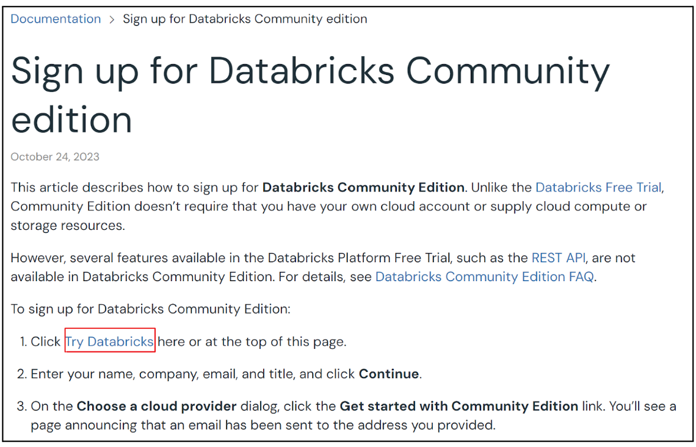
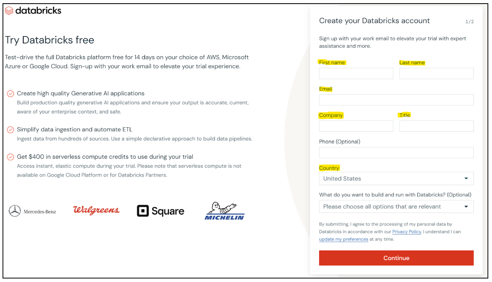
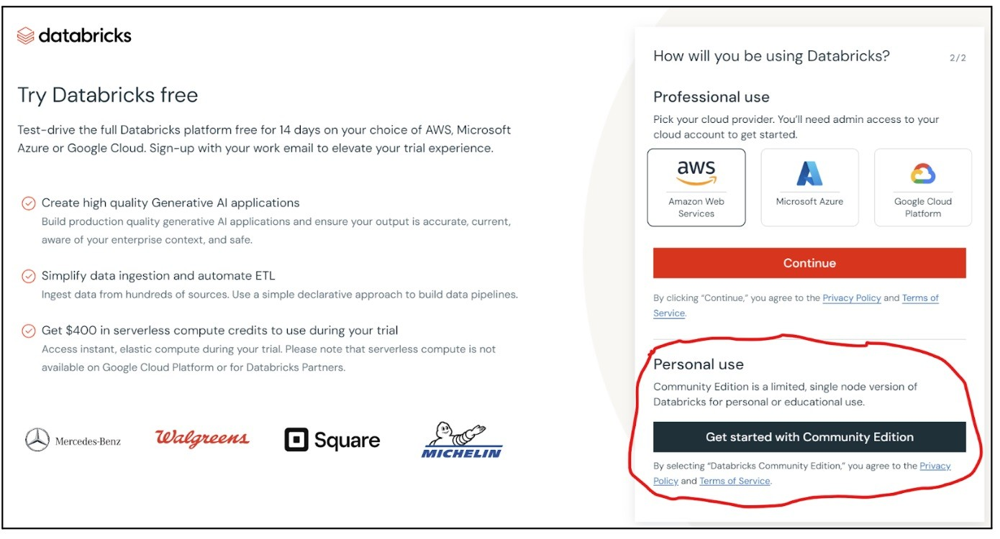
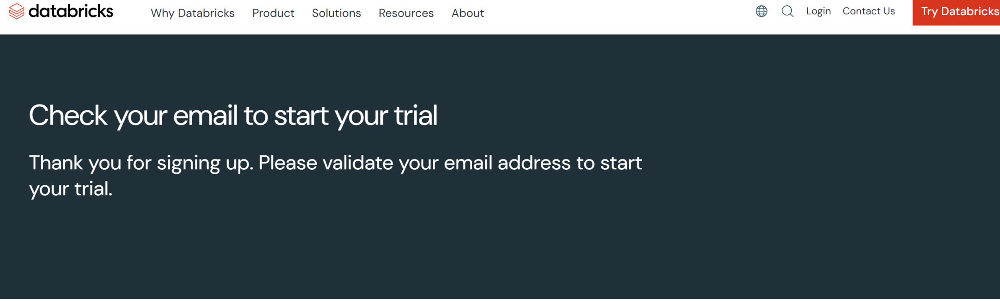
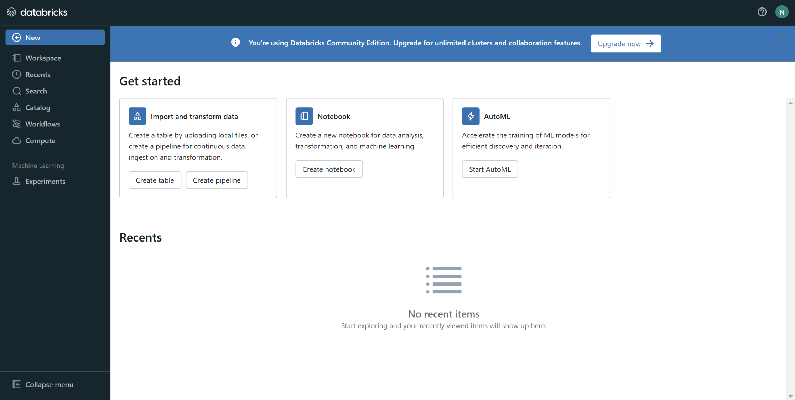

In just SIX steps, you can have a FREE instance of Databricks thru its [Community Edition](https://docs.databricks.com/en/getting-started/community-edition.html).

The Datarbicks Community Edition is a great resource for folks wanting an easy and __FREE__ way to get _hands-on_ experince with cloud computing.

No credit card or cloud account needed.

Just a __valid email__.

> Free is my JAM. 
> — <cite>Superintendent Reynolds</cite>



-----
## Visit the Docs to Sign up

[Click here to Sign up for Databricks Community edition](https://docs.databricks.com/en/getting-started/community-edition.html)

## Click "Try Databricks"

## Fill in the the required fields

Note: Make sure you are using a valid email.

## Click "Get Started with Community Edition"

## Validate your email + create a password

## Start Learning

-----

## Learning Resources

Here are some good resources to check out to continue your cloud learning and development journey on the Community Edition: 

### Databricks Documentation - Notebooks Quick Start

[Get started: Query and visualize data from a notebook](https://docs.databricks.com/en/getting-started/quick-start.html)

### Video - Databricks Academy Tutorial on Notebook Basics



### Video - The Next Generation of Databricks Notebooks



