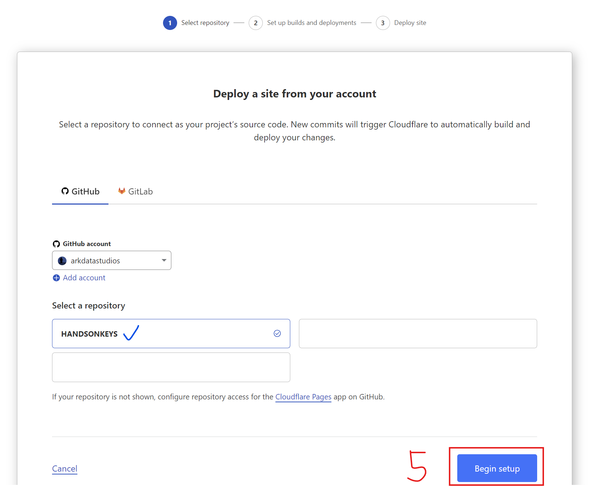

This hands-on guide will show you how to deploy your website for **free** with **Cloudflare Pages**.

[Pages](https://pages.cloudflare.com/) will make your next website deployment simple, while also ensuring *security, speed, and scalability*.

With Pages and its deep integration with GitHub, you can build and deploy your own static website with a simple **git push**!

-----

## Start with your GitHub Repository

Make sure you have a GitHub repo set up and working locally on your machine.

Cloudflare will deploy your website from a branch of your choosing.

You can get an example repo with for a demo site [here.](https://github.com/CaiJimmy/hugo-theme-stack-starter)

**Note: Public and Private repositiories are supported*

## Setup your Cloudflare Pages account

Make your account here: [Cloudflare Pages](https://pages.cloudflare.com/)

## Connect your GitHub Repository to Pages

Once you are loggeed in:

1. Select **Workers & Pages**
1. Select **Create**

3. Select **Pages**
4. Select **Connect to Git**

5. Select your Git repository and click **Begin setup**

## Configure Deployment

Now that you have selected a Git repository, configure your build and deployment settings.

If your project uses a **static site generator** or **build tool**, you can specify those settings on this page as well:

**Note*: ***HANDSONKEYS*** is powered by **Hugo + GO**

*  **Hugo** was selected in the Build settings.

* **GO** is a pre-installed tool in the Cloudflare Pages build environment. The version was specified in the Enirionment Varibles tab. See [Supported languages and tools](https://developers.cloudflare.com/pages/configuration/language-support-and-tools/) for more information.

## Save and Deploy

Once you have set up your build configuration, click **Save and Deploy**. 

When the deployment is complete, Cloudflare will provide an unique URL for your to view your site!

# Learning Resources

Here are some good resources to check out to continue your web development journey: 

### Deploy your website for free with Cloudflare Pages and GitHub!



### Set Up a Portfolio Website with Hugo



### Clouflare Pages Docs
The best tech advice you will ever get?

[Read the docs.](https://developers.cloudflare.com/pages)

