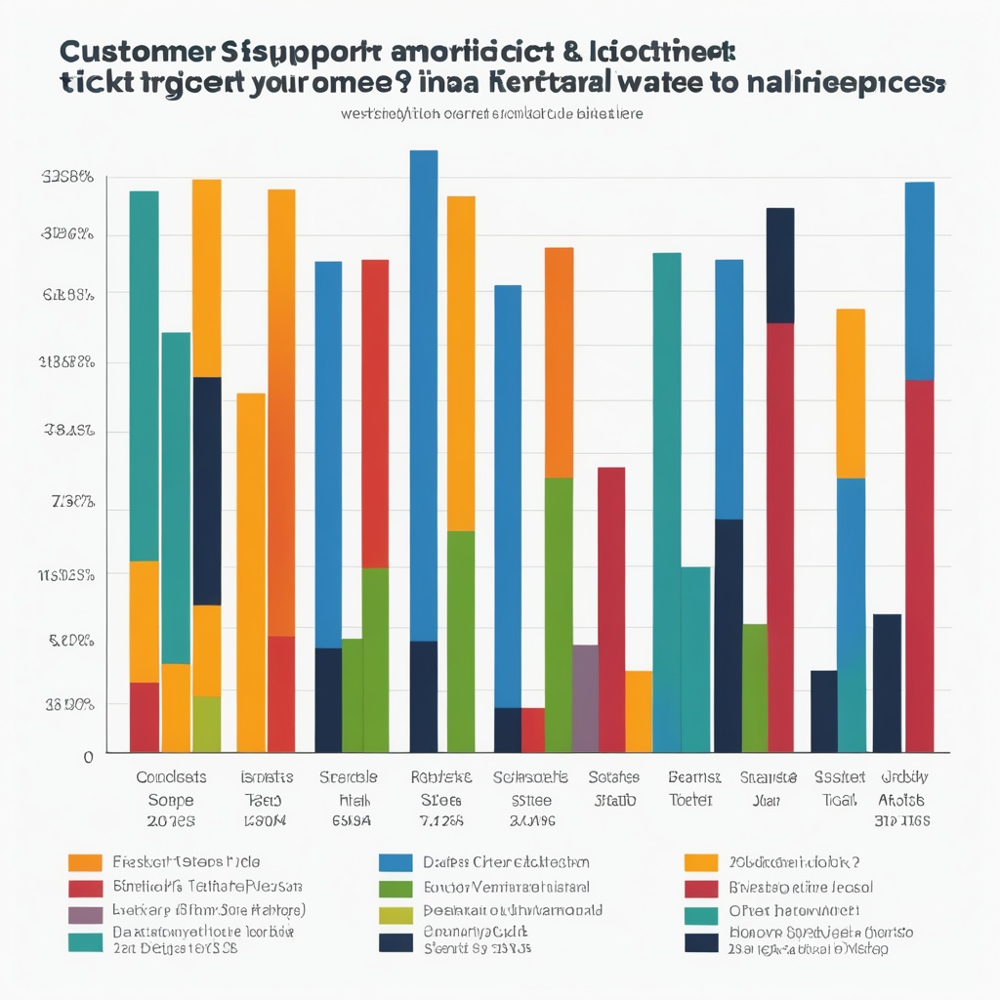

I was recently able to attend the AWS [Generative AI Innovation Day](https://aws-experience.com/amer/smb/e/2fe30/dallas-genai-innovation-workshop) in Dallas.

Here's how it went...

-----

##  *Start* - 9:00 AM CST

Upon entering the AWS office, I was promptly greeted by staff members that helped me get checked into the event.

With badge in hand, I headed down the hall, and into the conference room to find my seat.

I settled in and spent the rest of the hour provisioning my AWS Workshop Studio account while getting to know my first desk mate.

There were light refreshments available for breakfast, but on this day I passed.

I'm watching my figure.

## Keys or no Keys? - 10:00 AM

After a quick round of introductions, the AWS team gave attendees an overview of what the workshop would be covering during the day.

We were given a business case - *There are two companies going through a merger. They are in the process of combining their databases with each other.* - and a high level walk-thru of the solution architecture we would be implementing using various AWS services.

>*Amazon QuickSight, Amazon Bedrock, and Amazon Q were my stars for the day.*

[Amazon Quicksight](https://docs.aws.amazon.com/quicksight/latest/user/welcome.html) was the first service I became familiar with. I used it to explore the raw data I'd be working with. My first impression was that Quicksight gives the standard fair in terms of a BI experience, but my feelings changed during a future lab. More on this later... 

As the top of the hour approached, a question was raised about if "low code" or "pro code" experiences were preferred by AWS.
 
After listening to the answer, I was happy to learn about the AWS Mission, which is to provide developers ***choice***. AWS prides itself on having both options of "no code" and "pro code" development at a user's disposal.

However, this event definitely leaned in the "no-code" direction, which I felt was appropriate for a workshop setting. 

> *Keyboard bangers rejoice. No debugging needed for this workshop.*

## Let's get building - 11:30 AM

After getting familiar with our use case and associated data, it was time to get building.

A foundational aspect to any Generative AI application is its knowledge base. A knowledge base is the library of information an application will refer to while it generates its content. It could be filled with images, videos, tables, PDFs, etc. 

For this business case, our knowledge base would consist  of .TXT and .JSON files.

[Amazon Bedrock Knowledge Bases](https://aws.amazon.com/bedrock/knowledge-bases/) made this set-up a breeze. To configure, we used the Bedrock UI to point the location of our source data, select an embedding model, and configure a vector store. 

Once the knowledge base was set-up, we had a pretty cool RAG application up and running.

We asked **questions**:

> Question: *"Which state has the most associated customer support tickets over the past year?*

**Extracted Insights**:

> Answer: *New York*

And **visualized our data** with the model.

At the end of this block, my wheels were spinning. I could sense the same in other attendees. 

No matter your thoughts on if AI is good, bad or in the middle.

One thing is for sure.

People *want it*.

This workshop was proof.

##  Fui a almorzar - 12:30 PM

Lunch.

I had one and a half sandwiches. No sides though. I'll say I had one eye on my figure, the other on the plate.

More importantly, by this time, our duo had become a trio. We had a third join our table and we had a grand time. While these events are great for learning tech, my biggest takeaways come from the networking opportunities.

This day was no different, and I can confidently say, what happens at Gen AI events, stay there...

Shout-out to my desk-mates...

## Scott Boras - 1 PM

After lunch, it was time to set up our Agent.

No, we were not finding a date for [Scott Boras](https://en.wikipedia.org/wiki/Scott_Boras), but actually using **Amazon Bedrock Agents** to retrieve customer data from our knowledge base.

[AI Agents](https://aws.amazon.com/what-is/ai-agents/) are AI programs that can interact with other AI systems, collect data, and make its own decisions.

The Bedrock Agent Console made this setup surprisingly efficient, as I was able to start utilizing my AI agent after 15-20 minutes of setup. A click here, a scroll there, and before I knew it, I was able to give my agent a customer ID and have the associated order history, support history, and other details reported back to me. 

My second table mate, an experienced BI and Data executive, was blown away. He shared that he completes this task many times in his day to day function, and the ability to have a simple query return curated information was something he saw as a *definite value add* to his operation.

## Be Responsible - 2 PM

Now that the AI system was built, we had to make it safe.

By implementing Guardrails, we ensured that our applications would not return any hateful, inflammatory, or otherwise dangerous information.

See [this episode](https://www.youtube.com/watch?v=R0Uqx9J9pR4&list=PLhr1KZpdzukd23aGzGWMa03afLZr3aJS7&index=5) of AWS's Data Strategy Unraveled to learn more about the world of Responsible AI.



## *Fin* - 2:30 PM

In our final session, titled Generative BI, we covered ways to generate data-driven stories and insights by using natural language with Amazon Q with QuickSight. It was here where my feelings on QuickSight went from:

> *"Ehhh I've seen this before"*

 to
 
 > *"I haven't seen anything like this yet"*

Specifically, the ability to create *multiple* graphs and generate reports on the fly is what did it for me. Being able to bridge the gap between technical and non-technical stakeholders is an age old struggle, but after seeing a report generated in seconds, filled with graphs and insights, I was left thinking about the *art of the possible* in terms of what this technology could do for my teams, my past projects, and my future engagements. 

---

To close the day, we had an interactive quiz covering the topics we learned throughout the day.

The curious ones that completed their labs early and filled out the accompanying worksheet found themselves very prepared for the quiz, and a special prize was given to the winner.

Even though I didn't win the prize, being able to experience the day left me feeling like a ***winner***.

## Post-Credit Scene - 4 PM CST

Q: What happens when 30+ technologists walk into a bar?

>A: More networking!

During this time, I spoke with the other attendees and AWS staff to discuss the day over drinks and appetizers.

I passed on the apps, but did discover a love for Margherita Pizzas and Blueberry Moscow Mules. 

By this time in the day, my figure was nowhere in my sights.

There was too much great company around to look at anything else.

-- 🔑KEYS🔑 --

## **-More Gen AI with AWS-**

> 👇 Below are resources to learn more about Generative AI on AWS. 

### Video -  Data Strategy Unravelled: Creating Business Value with GenAI | AWS



### Video - Building Terraform Projects with Amazon Q Developer



### *Hands On* - AWS PartyRock | Create Gen AI Apps on the Web

Create your own AI apps!

[PartyRock](https://partyrock.aws/) is AWS's Gen AI Playground.

It's **free**, and all you need is an email.

I gave the F1 Helmet generator a shot:

Props to AWS for making this app public for the people to see.

Till next time...

*Workshop in collaboration with [bjss](https://www.bjss.com/).

